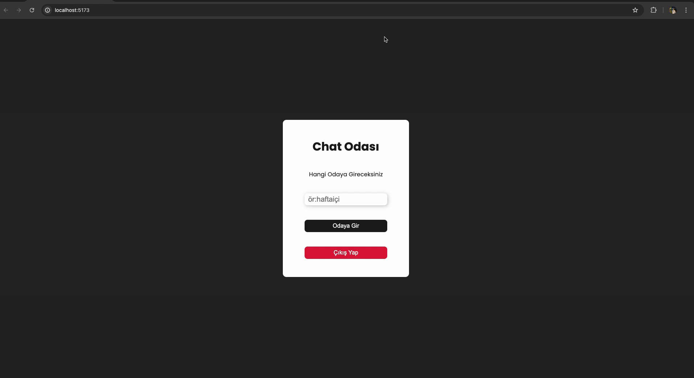

# React + Vite

- Proje Adı: Modern React Chat Uygulaması

Teknolojiler:

React: Kullanıcı arayüzünü oluşturmak için.
Firebase: Gerçek zamanlı veri tabanı, kimlik doğrulama ve barındırma hizmetleri için.
CSS/Styled-components: Modern ve kullanıcı dostu bir arayüz tasarımı için.
Özellikler:

Gerçek Zamanlı Mesajlaşma: Kullanıcılar anlık olarak mesaj gönderip alabilir.
Kullanıcı Kimlik Doğrulama: Firebase Authentication kullanarak güvenli giriş ve kayıt işlemleri.
Grup Sohbet Odaları: Farklı konu ve ilgi alanlarına yönelik grup sohbet odaları oluşturma ve katılma.
Profil Yönetimi: Kullanıcılar profil bilgilerini güncelleyebilir ve profil resimlerini yükleyebilir.
Mobil Uyumluluk: Hem masaüstü hem de mobil cihazlar için optimize edilmiş responsive tasarım.

 - GIF 

  
